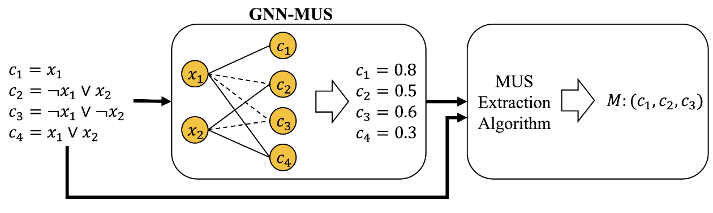
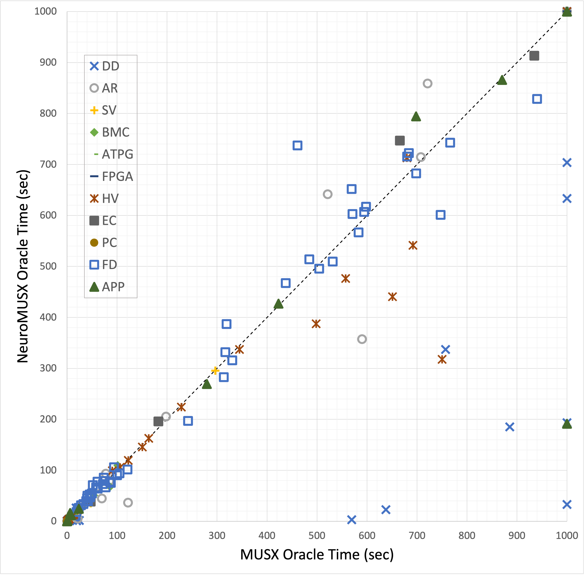
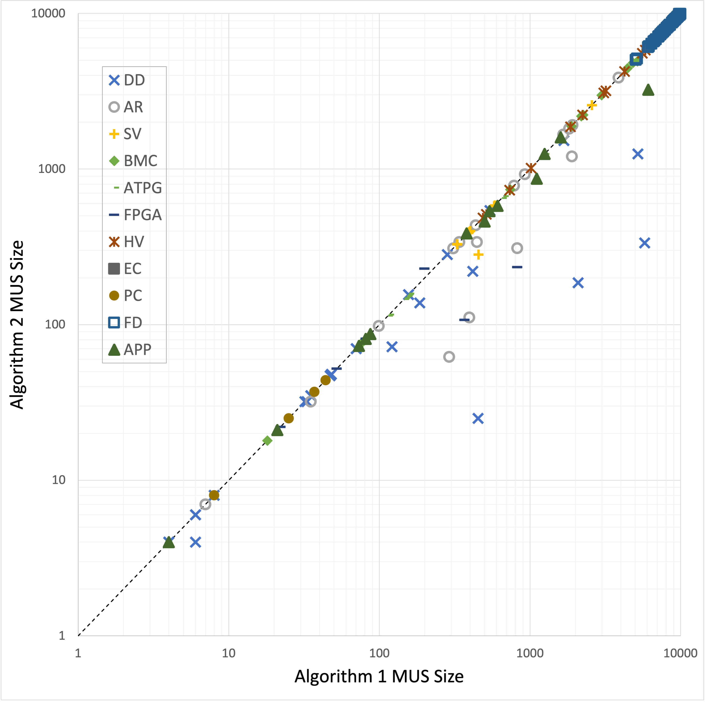
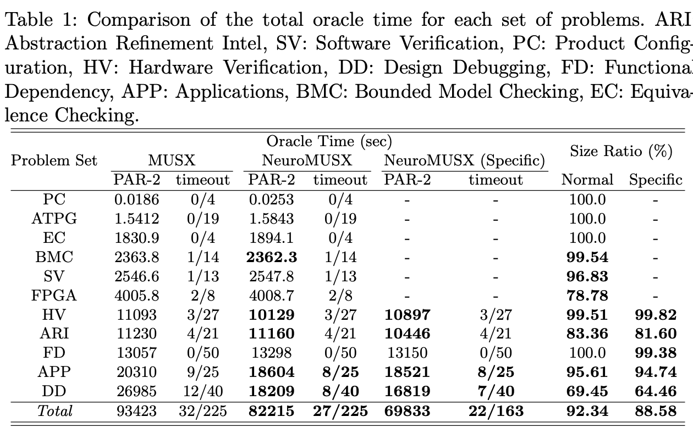

# Abstract
In Boolean Satisfiability (SAT), Minimal Unsatisfiable Subsets (MUSes) are unsatisfiable subsets of constraints that serve as explanations for the unsatisfiability which, as a result, have been used in various applications. Although various systematic algorithms for the extraction of MUSes have been proposed, few heuristic methods have been studied, as the process of designing efficient heuristics requires extensive experience and expertise. In this research, we propose the first trainable heuristic based on Graph Neural Networks (GNNs). We design a new network structure along with loss functions and learning strategies specifically tuned to learn the process of MUS extraction, which we implement in a model called GNN-MUS. Furthermore, we introduce a new algorithm called NeuroMUSX that uses GNN-MUS as a heuristic and combines it with other systematic search methods to make the extraction process more efficient. We conduct experiments to compare our proposed method with existing methods on the MUS Track of the 2011 SAT Competition. From the results, NeuroMUSX is shown to achieve significantly better performance across a wide range of problem instances. In addition, training NeuroMUSX on specific instances of a class improves the algorithm's performance against other problems in the same class, highlighting the advantages of the learnable approach. Overall, these results underscore the potential of using simple GNN architectures to drastically improve the procedures for extracting minimal subsets.
​
   

# Main framework of our Algorithm

  

​

# Main Results
### Improving deletion-based algorithms using NeuroMUSX as a heuristic (Randomly trained)
> Comparison with instances from SAT Competition 2011 MUS Track

  
  

​
   
​

### Improving deletion-based algorithms using NeuroMUSX as a heuristic (Specifically trained)
> Comparison with the problem sets that took the most time with Algorithm 1

  

​

      
​

# Usage
## Random instances
### Training
1. Move to the script folder: cd script
1. Setup the directories: bash setup.sh
1. Generate random instances: bash data_gen_random.sh
1. Load the random instances for training: bash data_load_random.sh
1. Train the model on random data: bash train_random.sh or python main.py
1. Move the model file in models/final to pretrained_models directory

### Testing
1. Move to the script folder: cd script
1. Download and unzip the cnf files from SAT Competiton 2011 MUS Track: bash data_load_satcomp2011.sh
1. Test the model on instances from the SAT Competition: bash test_random.sh

## Specific instances
1. Move to the script folder: cd script
1. Test the model on specific problem sets: bash test_specific_[dataset_name].sh

# Dependencies
1. <a href="https://pytorch.org">PyTorch</a>
1. <a href="https://pysathq.github.io">PySAT</a>
1. <a href="https://pytorch-geometric.readthedocs.io/en/latest/notes/installation.html">PyG</a>
1. <a href="https://matplotlib.org/stable/users/installing/index.html">Matplotlib</a>